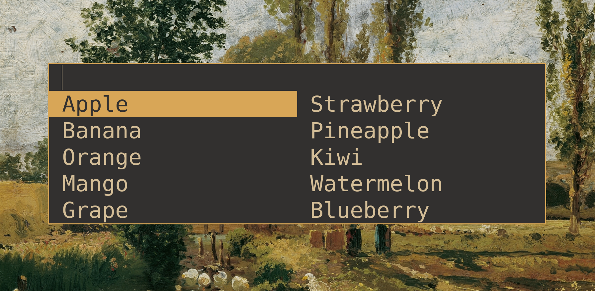

# vmenu - a vibe coded fork of dmenu

<p align="center">
  
</p>



`vmenu` is an efficient, fast, and feature-rich dynamic menu for X, built as a fork of the classic `dmenu` tool. This project is vibe coded with Google Antigravity with Gemini 3.5 Flash (Medium). It reads a list of newline-separated items from standard input, presents an interactive menu, and prints the user's selection to standard output.

## Features & Applied Patches

This fork incorporates several popular patches and enhancements to improve user experience:

- [Grid Layout](patchs/dmenu-grid-4.9.diff): Support for horizontal and vertical grid columns using the `-G` / `--columns` options.
- [Grid Navigation](patchs/dmenu-gridnav-5.0.diff): Arrow keys allow navigating between columns and rows seamlessly.
- [Centered Window](patchs/dmenu-center-4.8.diff): Center the menu on the monitor with `-c` / `--centered`.
- [Custom Borders](patchs/dmenu-border-4.9.diff): Define border thickness and color with `-bw` / `--border-width` and `-bc` / `--border-color`.
- [Fuzzy Highlights](patchs/dmenu-highlight-4.9.diff): Highlights matching text segments inside the menu options.
- [Instant Select](patchs/dmenu-instant-5.3.diff): Instantly confirm selection when only a single match remains using `-n` / `--instant`.
- [Line Height](patchs/dmenu-lineheight-5.2.diff): Custom height options for menu lines using `-h` / `--height`.
- [Mouse Support](patchs/dmenu-mousesupport-5.4.diff): Select and interact with menu items using mouse clicks.
- [Scroll Support](patchs/dmenu-scroll-20180607-a314412.diff): Seamless scrolling capability when items exceed the list limits.
- **Custom Width**: Custom window width setting using the `-W` / `--width` flag.
- **Custom Font Size**: Specify a custom font size using the `-fs` / `--font-size` flag.
- **Case-Insensitive Mode**: Toggle case-insensitivity at runtime using the `case_insensitive` parameter in config or command-line flags.
- **Print Screen Pass-Through**: Releasing keyboard grab dynamically on Print Screen (`XK_Print`) press to let system screenshot tools run.

## Dependencies

To compile and run `vmenu`, you need X11 header files, Xinerama, Fontconfig, and Xft libraries.

### Install on Debian / Ubuntu:
```bash
sudo apt-get update
sudo apt-get install -y build-essential libx11-dev libxinerama-dev libfontconfig1-dev libxft-dev
```

## How to Build

We use a custom, self-recompiling C-based build script (`build.c`) to build the project.

### 1. Bootstrap the Build Tool
First-time build the build system from build.c:
```bash
cc build.c
```

### 2. Compile Targets
Run the build tool specifying a target type (`dev`, `debug`, or `release`):
- **Development Build** (with sanitizers):
  ```bash
  ./a.out build dev
  ```
- **Debug Build** (without sanitizers, debug-friendly):
  ```bash
  ./a.out build debug
  ```
- **Release Build** (fully optimized):
  ```bash
  ./a.out build release
  ```

### 3. Running & Testing
You can compile and run targets automatically with program parameters:
```bash
echo -e "Apple\nBanana\nOrange" | ./build/build build-run release
```

### 4. Clean Build Artifacts
Clean object files and built binaries safely while keeping the `build/build` executable intact:
```bash
./build/build clean
```

### 5. Install & Uninstall
- **Install**: Installs the release binary to your local environment namespace (default prefix `/usr/local/bin`):
  ```bash
  sudo ./build/build install
  ```
- **Uninstall**: Removes installed binaries and manuals:
  ```bash
  sudo ./build/build uninstall
  ```

## How Configuration Works

`vmenu` loads a dynamic configuration file rather than relying strictly on compile-time headers.

- **Default Config Path**: Loads config from `$XDG_CONFIG_HOME/vmenu/config.conf` (usually `~/.config/vmenu/config.conf`) if it exists.
- **Print Default Configuration**: Dump the built-in configuration template directly to standard output:
  ```bash
  vmenu -pc
  # or
  vmenu --print-config
  ```
- **Generate Configuration File**: Write the default template to XDG config path or a custom path:
  ```bash
  vmenu -g
  # or
  vmenu --generate-config               # Writes to default path
  vmenu --generate-config /custom/path  # Writes to specified path
  ```
- **Use Custom Configuration**: Force `vmenu` to load a configuration file from a specific location:
  ```bash
  vmenu -cf /path/to/config.conf
  # or
  vmenu --config /path/to/config.conf
  ```

## Command Line Flags

You can retrieve all available command-line flags by passing `--help` or `-h`.

## Download Release Builds

Automated release builds are published whenever changes are pushed to `master`/`main`.
- Binaries are distributed as **pure, unzipped executables**.
- Builds are compiled for both **AMD64 (x86_64)** and **ARM64 (AArch64)** architectures.
- Visit the **Releases** section on the GitHub repository page to download the standalone binaries: `vmenu-amd64` and `vmenu-arm64`.
